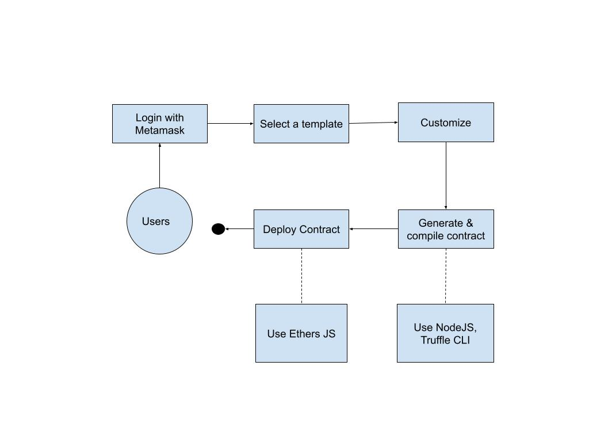

# Overview

This app is a tool for non-technical users. Users can customize, compile and deploy own smart contracts. This app support both testnet & mainnet on most of evm-supported chains.

# How it works

# Features
- [x] Login with metamask
- [x] Customize contract
- [x] Generate contract
- [x] Deploy contract
- [x] Support testnet & mainnet on evm-supported chain.
- [x] NFT collection contract template
- [ ] NFT marketplace contract template
- [ ] NFT drop contract template
- [ ] SocialFi contract template
- [ ] Vote contract template
- [ ] Donation contract template
- [ ] dApp generator

# Getting Started

To run this source code, you need to follow steps:
- Clone this source
- Register a Moralis account
- Create new Moralis App
- Create a .env.local file. You can see this guide.
- Run these commands:
  - npm i
  - npm run build & npm run start (for production mode)
  - npm run dev (for dev mode)
  
# Tech stack
- Solidity
- OpenZeppelin
- Moralis Auth API
- NextJS 12
- Type script
- Redux & Redux toolkit
- EthersJS
- Truffle

